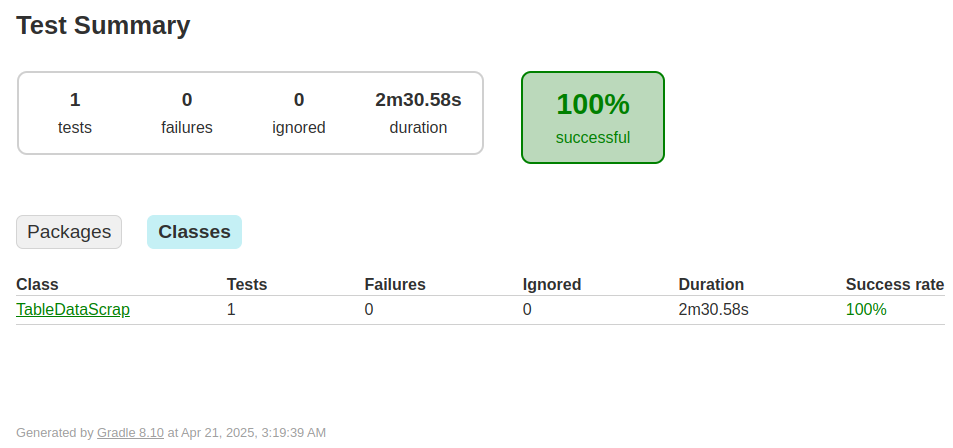

# Web Automation Project

## Description
This project automates two web forms and scrapes a table from a website using **Selenium WebDriver** and **JUnit**. The main tasks are:
- Automate form submission on [Digital Unite Webform](https://www.digitalunite.com/practice-webform-learners)
- Automate guest registration on [WP Everest Form](https://demo.wpeverest.com/user-registration/guest-registration-form/)
- Scrape stock market data from [DSEBD Website](https://dsebd.org/latest_share_price_scroll_by_value.php)


### Tech Stack

- **Java 17**
- **Selenium WebDriver**
- **JUnit** (for testing)
- **Gradle** (for project management)
- **ChromeDriver** (for browser automation)


## Prerequisites

Before running the tests, ensure the following:

- Java 17 or higher
- ChromeDriver (or another WebDriver if you're using a different browser)

The project dependencies for Selenium WebDriver and JUnit 5 are already configured in the `build.gradle` file:

```groovy
dependencies {
    testImplementation platform('org.junit:junit-bom:5.10.0')
    testImplementation 'org.junit.jupiter:junit-jupiter'
    implementation 'org.seleniumhq.selenium:selenium-java:4.31.0'
}
```


## How to run
1. Clone the repo:
    ```bash
    git clone https://github.com/ShababAhmedd/AutomatedWebFormsAndScraping
    ```

2. Set Up ChromeDriver
   Make sure **ChromeDriver** is properly set up and available in your system's PATH.

   - Download **ChromeDriver** from: [ChromeDriver Download](https://sites.google.com/a/chromium.org/chromedriver/downloads)
   - Ensure that the downloaded `chromedriver` binary is added to your system’s **PATH**.
   - Alternatively, specify the path to ChromeDriver in your test code if it’s not in the PATH.

   Example (if you're setting it manually in your code):
   ```java
   System.setProperty("webdriver.chrome.driver", "/path/to/chromedriver");
   ```

4. Run all tests with Gradle:
    ```bash
    ./gradlew test
    ```
    This will execute all the tests in the project.

    To run a specific test class (e.g., DigitalUniteForm), use:
    ```bash
    ./gradlew test --tests "PracticeWebform"
    ```
    Replace "PracticeWebform" with the name of any test class you want to run.
   
5. Check test results in the **build/reports/tests/test** folder.
   - This folder contains detailed HTML test report for the test class you run.
   - You can open the `index.html` file to view test results, or check the console logs for additional details.
  
## Video Demonstrations
- Watch Task 1: Digital Unite Webform Automation
https://github.com/user-attachments/assets/91e778f7-96c2-42f6-b6d7-f38663a318c7

- [Watch Task 2: WP Everest Guest Registration Form Automation](videos/userRegistration.mp4)
- [Watch Task 3: DSEBD Data Scraping](videos/TableDataScraps.mp4)

## Test Report 
- Task 1: Digital Unite Webform Automation  
  

- Task 2: WP Everest Guest Registration Form Automation  
  

- Task 3: DSEBD Data Scraping  
  
